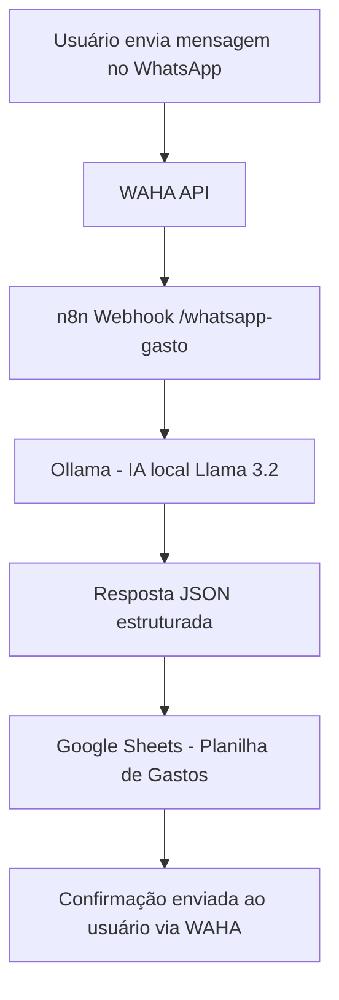

# 🎯 WhatsApp Expense Tracker

Sistema automático de rastreamento de gastos via WhatsApp com IA local e integração Google Sheets.

## 🏗️ Arquitetura



## 🛠️ Tecnologias

- **n8n**: Orquestração do fluxo de automação
- **Docker**: Containerização dos serviços  
- **Google Sheets**: Armazenamento dos dados
- **Ollama + Llama 3.2**: IA local para interpretação das mensagens
- **WAHA**: Integração com WhatsApp

## 🚀 Como usar

1. **Configuração inicial**:
   ```bash
   ./start.sh
   ```

2. **Configurar Google Sheets**:
   - Criar credenciais de conta de serviço
   - Importar workflow no n8n
   - Configurar ID da planilha

3. **Conectar WhatsApp**:
   - Acessar WAHA e escanear QR Code
   - Enviar mensagens de teste

## 📱 Exemplos de uso

**Gasto registrado**:
```
Gastei R$ 25,50 com almoço no restaurante
```

**Resultado na planilha**:
- Valor: 25.50
- Descrição: almoço no restaurante  
- Categoria: alimentação
- Data: 2025-01-09
- Telefone: +5511999999999

## 📖 Documentação completa

Veja [SETUP.md](SETUP.md) para instruções detalhadas de instalação e configuração.

## 🌐 Deploy em VPS

Para deploy na VPS 31.97.90.110:
```bash
scp -r . root@31.97.90.110:/opt/whatsapp-gastos
ssh root@31.97.90.110
cd /opt/whatsapp-gastos
./setup-vps.sh
```

## 🔧 Portas utilizadas

- **5678**: n8n Web Interface
- **3000**: WAHA (WhatsApp API)
- **11434**: Ollama (IA Local)

## 📊 Estrutura da planilha

| timestamp | phone_number | original_message | tipo | valor | descricao | categoria |
|-----------|--------------|------------------|------|-------|-----------|-----------|
| 2025-01-09T10:30:00Z | +5511999999999 | Gastei R$ 25,50 com almoço | transacao | 25.50 | almoço | alimentação |